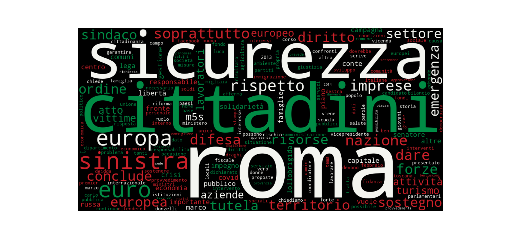
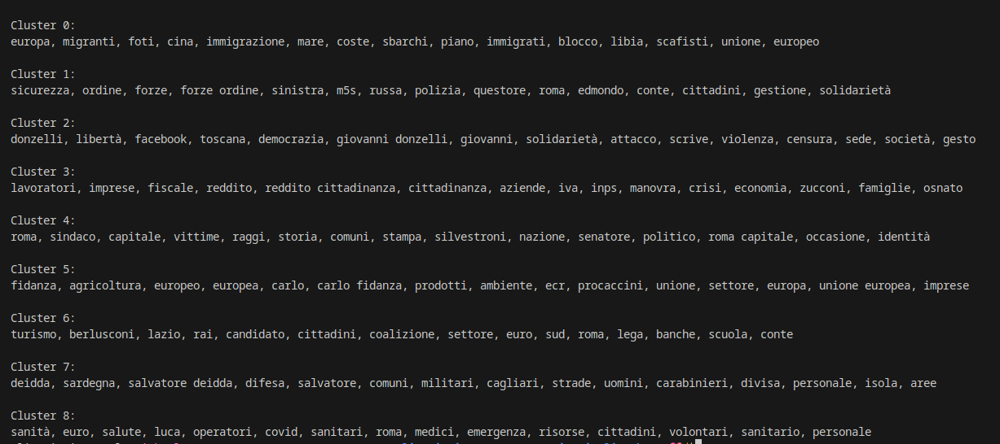

# Meta-récits de l'Italie contemporaine

Dans le cadre du cours *Lignuistique pour le TAL* (INALCO 2025).

## Carnet de recherche

### Construction d'un corpus

Dans un premier temps, nous avons collecté les communiqués de presse de la présidence du conseil italien. Notre idée était de trouver des descriptions de la vie politique du gouvernement révélatrice de récits politiques. Finalement, le contenu ne semblait pas assez marqué d'opinion. Nous avons donc décidé de collecter les communiqués de presse du parti Fratelli d'Italia, parti actuellement au pouvoir en Italie. Notre hypothèse est que la communication d'un parti verse plus dans l'opinion qu'une institution d'Etat – aussi politique qu'elle soit.

### Modélisation des récits

Les communiqués de presse du parti en poche, la prochaine étape consiste à construire un prompt de LLM assez efficace pour 1) identifier les récits dans un texte 2) identifier les éléments de chacun de ces récits.

**expérience**

Ecriture d'un petit script pour tester la méthode d'annotation des récits (éléments actantiels). Pour l'utiliser :

```bash
$ uv run extract.py <path texte> <path system prompt> <path reason prompt> <path extract prompt>
```
### Premières observations

Les premiers tests avec le script avec des textes pris au hasard dans notre corpus donnait des résultats aléatoire. Les textes trop courts créaient trop de champs vides dans le json ou bien c'était des tweets/ faits très ponctuels donc pas le plus pertinent pour l'extraction de métarecit.

Nous avons donc décidé de garder manuellement les textes les plus longs et pertinents. Nous avons sélectionné et lu 10 textes qui nous paraissait intéressant à extraire, principalement des discours ou des déclarations. Globalement, l'extraction fonctionne plutôt bien. Il y avait cependant des petit soucis avec la langue. Les textes sont en italien et l'extraction est demandé au LLM en fr, du coup parfois le json est en français parfois en italien, parfois un peu des deux et le plus drôle c'est parfois du français italianisé. Des mots français écrits à l'italienne (ex: journée qui donne giornée)

Ainsi la question de l'amélioration du prompt se pose. Faut-il n'exiger que du français pour uniformiser l'extraction? De même concernant le corpus et sa pertinence. Faut-il le resteindre à seulement les textes les plus longs?

Avant cela, nous avons aussi fait une comparaison des résultats avec le prompt original (sans aspect temporel) et avec l'ajout de la notion de temps dans lequel s'ancre le texte. Les json générés avec le prompt sans l'aspect temps ont des raisonnements plus détaillés qui résument davantage le texte alors que lorsque l'on passe le même texte mais cette fois-ci avec le prompt de temps, le raisonnement est plus synthétique. Le LLM dit sur quoi il se base pour faire l'analyse mais il ne parle directement du contenu du texte. On dirait qu'il répète juste le prompt. Aussi, la longueur du json varie en fonction de la run. En gros des fois on se retrouve avec plusieurs descriptions (donc plus de détail sur le texte mais c'est pas le cas pour tous et ça a l'air assez aléatoire).

Un autre aspect à améliorer serait du coup de voir comment améliorer le prompt pour intégrer la notion de temps sans affecter les autres catégories.

#### statistiques descriptives

D'après les 50 mots les plus fréquents, nous pouvons dire que :

- **Sécurité et ordre public** : fréquence élevée de *sicurezza, difesa, forze, ordine, vittime, emergenza* => discours centré sur protection, lutte contre les risques et maintien de l’ordre.
- **Économie et entreprises** : présence de *imprese, aziende, lavoratori, economia, risorse, settore, crisi* => soutien aux entreprises et à l’emploi.
- **Identité nationale et territoire** : *nazione, cittadini, territorio, comuni, famiglie* => cohésion nationale, collectivités locales et structures sociales de base.
- **Europe et relations européennes** : *europa, europea, europeo, euro* => thème de l'union européenne récurrent.
- **Solidarité et soutien social** : *sostegno, solidarietà, tutela, libertà*
- **Thèmes sectoriels spécifiques** : *turismo, gestione, attività*
- **Références politiques externes** : *sinistra, lega, m5s, conte, lollobrigida* => allusions fréquentes aux autres acteurs du paysage politique.



C'était assez prévisible mais du coup les sujets dominants concernent la sécurité, l’économie, l’identité nationale, les enjeux européens et le soutien social, avec des références régulières aux adversaires politiques.

Pour avoir ces infos nous avons choisi de supprimmer les stopwords italiens standards avec spacy afin d'éviter que les stats soient dominées par des mots purement grammaticaux. On a rajouter manuellement des termes propres au contexte politique du dataset (ex. *meloni, fratelli, fdi, giorgia, centrodestra, partito*). Car ces mots apparaissent mécaniquement dans tous les textes ccomme ils proviennent d’un même acteur politique donc ils n’informent pas sur les thèmes. Pareillement on a retiré des mots liés à tout ce qui es institutionnelle, thème trop génral et évident vu la nature du corpus. On veut éviter que les fréquences reflètent seulement la structure des communiqués politiques plutôt que leur contenu thématique.

#### clustering des textes pré-traitement

Un clustering K-Means a été appliqué en testant plusieurs valeurs de k entre 2 et 10, et la qualité de chaque partition a été évaluée à l’aide du score de silhouette, qui est resté faible, ce qui est attendu pour un corpus homogène.

L’analyse des mots les plus représentatifs de chaque cluster permet d’identifier neuf grands ensembles thématiques. Le premier regroupe les textes consacrés à l’immigration, aux arrivées par la mer et aux relations avec l’Union européenne. Le deuxième concerne la sécurité intérieure, l’ordre public et les positions vis-à-vis des autres partis. Le troisième rassemble les contenus liés à Giovanni Donzelli et aux polémiques autour de la liberté d’expression. Un quatrième cluster porte sur l’économie, les entreprises, la fiscalité et les mesures sociales. Un cinquième se concentre sur Rome, ses institutions locales, ses élus et les enjeux propres à la capitale. Le sixième renvoie aux questions agricoles, à l’environnement et aux prises de position des eurodéputés du parti. Un septième regroupe les textes liés au tourisme, aux campagnes régionales, aux médias et aux coalitions politiques. Le huitième correspond aux sujets de défense, aux forces armées et aux interventions spécifiques en Sardaigne. Enfin, le neuvième réunit les textes consacrés à la santé, au COVID, aux personnels médicaux et aux ressources allouées au secteur sanitaire.




